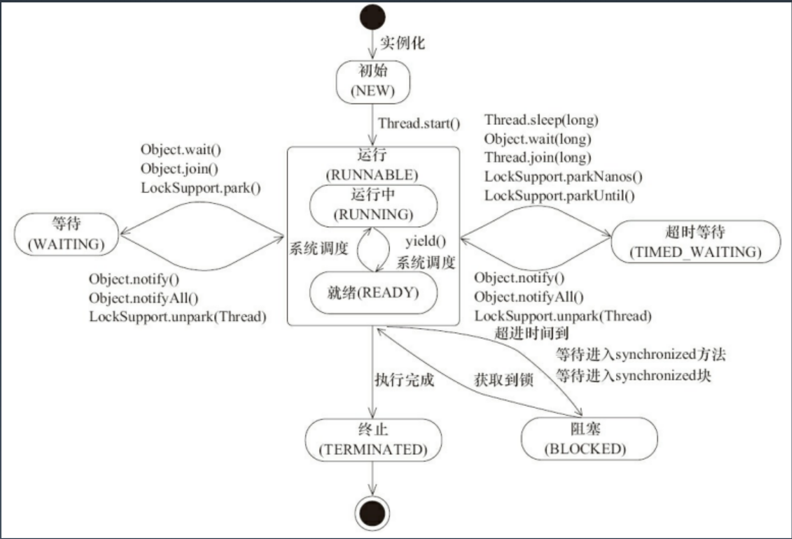
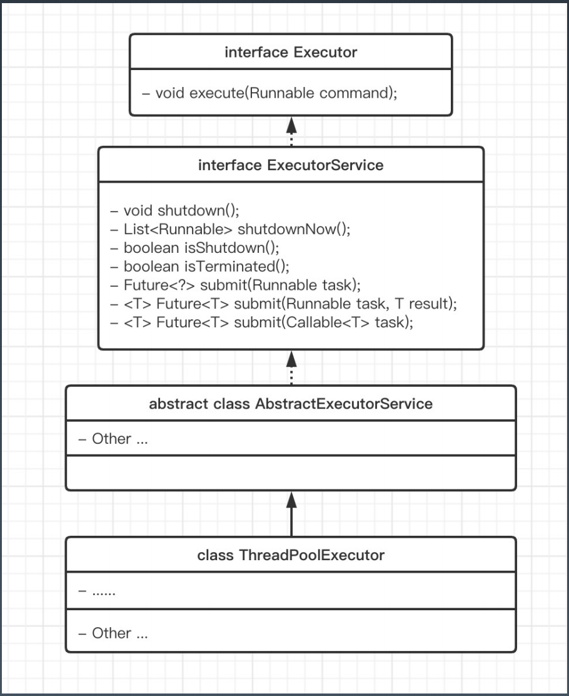

学习笔记

## 目录

一、多线程基础
* 1、java 线程创建过程
* 2、线程状态
* 3、线程方法
* 4、线程状态的改变
* 5、Thread 的中断与异常处理
* 6、Thread 状态
* 7、线程组
* 8、线程安全
* 9、线程基础接口

二、线程池
* 1、Excutor、ExcutorService、ThreadFactory、Excutors
* 2、ThreadPoolExecutor提交任务逻辑
* 3、线程池参数
   - 1）缓冲队列
   - 2）拒绝策略
* 4、创建线程池方法
* 5、创建固定线程池的经验

三、显示的锁
* 1、基础接口：Lock
   - ReentrantLock
   - ReentrantReadWriteLock
   - Condition
* 2、LockSupport
* 3、用锁最佳实践

四、并发原子类 java.util.concurrent.atomic
* 1、AtomicInteger、AtomicLong ....
* 2、无锁技术底层实现
* 3、LongAdder：分段思想

五、并发工具类 java.util.concurrentcy
* 1、信号量工具类
   - Semaphore
   - CountdownLatch
   - CyclicBarrier
* 2、线程返回值
   - Future
   - FutureTask
   - CompletableFuture

六、集合类

七、并发编程
   - ThreadLocal
   - Stream
   - 线程间协作与通信

---


### 一、基础知识

* 进程：操作系统基本运行单位是进程

* 线程：CPU基本的调度单位，同一进程内所有线程共享进程资源

#### 1、Java 线程创建过程

* Java 层面
* JVM 层面
* OS 层面

* 守护线程：后台运行，当所有线程都是守护线程，jvm将会退出。

#### 2、线程状态

* Runable 可运行状态，等待CPU调度
* Running 运行状态
* Non-Runnable 等待 （wait,sleep,join）

#### 3、线程方法

* sleep：释放CPU权限
* wait：释放CPU权限，释放占有锁的权限，通过notify唤醒

#### 4、线程状态的改变

```
1.Thread.sleep(long millis)：
一定是当前线程调用此方法，当前线程进入TIMED_WAITING状态，但不释放对象锁，millis后线程自动苏醒进入就绪状态。作用:给其它线程执行机会的最佳方式。

2. Thread,yield()：
一定是当前线程调用此方法，当前线程放弃获取的CPU时间片，但不释放锁资源，由运行状态变为就
绪状态，让OS再次选择线程。作用:让相同优先级的线程轮流执行，但并不保证一 定会轮流执行。
实际中无法保证yield()达到让步目的，因为让步的线程还有可能被线程调度程序再次选中。
Thread.yield()不会导致阻塞。该方法与sleep()类似，只是不能由用户指定暂停多长时间。

3.t.join()/t.join(long millis)：
当前线程里调用其它线程t的join方法，当前线程进入WAITING/TIMED_WAITING状态，当前线程不会释放已经持有的对象锁。线程t执行完毕或者millis时间到，当前线程进入就绪状态。

4.obj.wait()：
当前线程调用对象的 wait()方法，当前线程释放对象锁，进入等待队列。
依靠notify()/notifyAll()唤醒或者wait(long timeout)timeout时间到自动唤醒。

5.obj.notify()：
唤醒在此对象监视器上等待的单个线程，选择是任意性的。notifyAll()唤醒在此对象监视器上等待的所有线程。
```

#### 5、Thread 的中断与异常处理

```
1.线程内部自己处理异常，不溢出到外层。

2.如果线程被Object.wait, Thread.join和Thread.sleep三种方法之一阻塞，此时调用该线程的
interrupt()方法，那么该线程将抛出一个InterruptedException中断异常(该线程必须事先预备好处理此异常)，从而提早地终结被阻塞状态。如果线程没有被阻塞，这时调用
interrupt()将不起作用，直到执行到wait(),sleep(),join()时,才马上会抛出
InterruptedException。
```

#### 6、Thread 状态

* 本线程主动操作
* 被动：遇到锁、被通知
---
* Runnable
* Ready
---
* Waiting （等待别人通知）
* Time_Waiting (调度器唤醒)
---
* Blocked



#### 7、线程组
```
// 线程标识符
Thread.currentThread().getId()
// 线程优先级，会被继承，无法覆盖
Thread.currentThread().getPriority()
// 线程状态
Thread.currentThread().getState()
// 是否是守护线程，默认false，会被继承，无法覆盖
Thread.currentThread().isDaemon()
// 是否活跃
Thread.currentThread().isAlive()
// 所属线程组
Thread.currentThread().getThreadGroup()
```
```
java.lang.ThreadGroup[name=main,maxpri=10]
    Thread[main,5,main] // 线程名，优先级，线程组
    Thread[Monitor Ctrl-Break,5,main]  

java.lang.ThreadGroup[name=system,maxpri=10]
    Thread[Reference Handler,10,system]
    Thread[Finalizer,8,system]
    Thread[Signal Dispatcher,9,system]
    java.lang.ThreadGroup[name=main,maxpri=10]
        Thread[main,5,main]
        Thread[Monitor Ctrl-Break,5,main]
```

#### 8、线程安全

* 原子性

* 可见性
    * 当一个共享变量被volatile修饰时，它会保证修改的值会立刻被更新到主存，当有其他线程读取时，会去内存读取新值。
    * synchronized 和 Lock 能够保证可见性
    * volatile 不保证原子性
* 有序性
    * volatile、synchronized、lock
    * happens-before
* volatile
    * 适用场景：单个线程写；多个线程读
    * 替代方案：Atomic 原子操作类
* final

#### 9、线程基础接口

```
1、Runable#run() 没有返回值

2、Callable#call()  有返回值
```

---

### 二、线程池

#### 1、Excutor、ExcutorService、ThreadFactory、Excutors
```
1.Excutor：执行者-顶层接口

2.ExcutorService：接口API

3.ThreadFactory：线程工厂

4.Excutors：工具类
```



```
线程池从功能上看就是一个任务执行器

submit 方法-> 有返回值，用Future封装

execute 方法-> 无返回值

submit 方法异常可以在主线程中catch到

execute 方法执行任务是捕捉不到异常的
```

#### 2、ThreadPoolExecutor提交任务逻辑:

```
1.判断corePoolSize[创建]

2.加入workQueue

3.判断maximumPoolSize[创建]

4.执行拒绝策略处理器

public void execute(Runnable command) {
    if (command == null)
        throw new NullPointerException();
    int c = ctl.get();
    if (workerCountOf(c) < corePoolSize) {
        if (addWorker(command, true))
            return;
        c = ctl.get();
    }
    if (isRunning(c) && workQueue.offer(command)) {
        int recheck = ctl.get();
        if (! isRunning(recheck) && remove(command))
            reject(command);
        else if (workerCountOf(recheck) == 0)
            addWorker(null, false);
    }
    else if (!addWorker(command, false))
        reject(command);
}
```

#### 3、线程池参数

* 1）缓冲队列
```
BlockingQueue是双缓冲队列。BlockingQueue内部使用两条队列，允许两个线程同时向队列一个存储，一个取出操作。
在保证并发安全的同时，提高了队列的存取效率。

1. ArrayBlockingQueue

2. LinkedBlockingQueue

3. PriorityBlockingQueue

4. SynchronizedQueue
```
* 2）拒绝策略
```
1. ThreadPoolExecutor.AbortPolicy（默认）：丢弃任务并抛出RejectedExecutionException异常。

2. ThreadPoolExecutor.DiscardPolicy： 丢弃任务，但是不抛出异常。

3. ThreadPoolExecutor.DiscardOldestPolicy： 丢弃队列最前面的任务，然后重新提交被拒绝的任务

4. ThreadPoolExecutor.CallerRunsPolicy： 由调用线程(提交任务的线程)处理该任务
```

#### 4、创建线程池方法

```
1. newSingleThreadExecutor
创建一个单线程的线程池。这个线程池只有一个线程在工作，也就是相当于单线程串行执行所有任务。如果这个唯一的线程因为异常结束，那么会有一个新的线程来替代它。此线程池保证所有任务的执行顺序按照任务的提交顺序执行。

2.newFixedThreadPool
创建固定大小的线程池。每次提交一个任务就创建一个线程，直到线程达到线程池的最大大小。线程池的大小一旦达到最大值就会保持不变，如果某个线程因为执行异常而结束，那么线程池会补充一个新线程。

注意：默认 LinkedBlockingQueue ，队列大小默认无穷大。最大线程数将没有意义。

3. newCachedThreadPool
创建一个可缓存的线程池。如果线程池的大小超过了处理任务所需要的线程，
那么就会回收部分空闲(60秒不执行任务)的线程，当任务数增加时，此线程池又可以智能的添加新线程来处理任务。此线程池不会对线程池大小做限制，线程池大小完全依赖于操作系统(或者说JVM)能够创建的最大线程大小。

注意：线程数默认无穷大

4.newScheduledThreadPool
创建一个大小无限的线程池。此线程池支持定时以及周期性执行任务的需求。
```

#### 5、创建固定线程池的经验

```
假设核心数为 N

1、如果是CPU密集型应用，则线程池大小设置为N或N+1

2、如果是IO密集型应用，则线程池大小设置为2N或2N+2
```

---

### 三、显示的锁

#### 1、基础接口：Lock

1、使用灵活、性能开销小

2、锁工具包：java.util.concurrent.locks

```
// 可重入锁 + 公平锁
Lock lock = new ReentrantLock(true);
```

```
// 可重入锁 + 读写锁 + 公平锁
ReadWriteLock lock = new ReentrantReadWriteLock(true);

// 写锁；独占锁；被读锁排斥
lock.writeLock().lock();
lock.writeLock().unlock();

// 读锁；共享锁；保证可见性
lock.readLock().lock();
lock.readLock().unlock();
```

#### 2、基础接口：Condition

```
await();  类比：Object#wait();
awaitUninterruptibly();

signal(); 类比：Object#notify();
signalAll(); 类比：Object#notifyAll()
```

#### 3、LockSupport：锁当前线程

#### 4、用锁最佳实践

```
1.永远只在更新对象的成员变量时加锁
2.永远只在访问可变的成员变量时加锁
3.永远不在调用其他对象的方法时加锁
```

---

### 四、并发原子类 java.util.concurrent.atomic

#### 1、主要类：

```
AtomicInteger

AtomicLong

.....
```

#### 2、无锁技术的底层实现：

* 概念：悲观锁、乐观锁、自旋

```
1、volatile

2、Unsafe API：Compare-And-Swap
```

#### 3、LongAdder：分段思想

---

### 五、并发工具类 java.util.concurrentcy

AbstractQueuedSynchronizer：抽象队列式的同步器

#### 1、信号量工具类

1、Semaphore：信号量

* 场景：同一时间控制并发线程数

2、CountdownLatch：减法计数

* 场景：Master线程等待Worker线程把任务执行完

3、CyclicBarrier：加法计数

* 场景：任务执行到一定阶段，等待其他任务对齐。

#### 2、Future、FutureTask、CompletableFuture

```
Future：单线程，单任务，一直等 （可以设置超时时间）

FutureTask：单线程，单任务，一直等 

CompletableFuture：变换结果、消费、组合、竞争、补尝异常
```
---

### 六、集合类

线性数据结构都源于Collection接口，并且拥有迭代器

List：ArrayList、LinkedList、Vector、Stack

Set：LinkedSet、HashSet、TreeSet

Queue->Deque->LinkedList


Map：HashMap、LinkedHashMap、TreeMap、

Dictionary->HashTable->Properties


* ArrayList
```
基本特点：基于数组，便于按index访问，超过数组需要扩容，扩容成本较高
用途：大部分情况下操作一组数据都可以用 ArrayList
原理：使用数组模拟列表，默认大小10，扩容x1.5，new Capacity=oldCapacity+(oldCapacity>>1)

安全问题：
1、写冲突
两个写,相互操作冲突
2、读写冲突
读，特别是iterator的时候，数据个数变了，拿到了非预期数据或者报错产生ConcurrentModificationException
```
* LinkedList
```
基本特点：使用链表实现,无需扩容
用途：不知道容量，插入变动多的情况
原理：使用双向指针将所有节点连起来

安全问题:
1、写冲突
两个写，相互操作冲突
2、读写冲突
读，特别是 iterator的时候，数据个数变了
拿到了非预期数据或者报错
产生 ConcurrentModificationException

List线程安全的简单办法
既然线程安全是写冲突和读写冲突导致的
最简单办法就是,读写都加锁。
例如:
1. ArrayList的方法都加上synchronized-> Vector
2. Collections.synchronizedList，强制将List的操作加上同步
3. Arrays.asList，不允许添加删除，但是可以set替换元素
4. Collections.unmodifiableList，不允修改内容，包括添加删除和set
```
* CopyOnWriteArrayList
```
核心改进原理
1、写加锁，保证不会写混乱
2、写在一个Cpy副本上，而不是原始数据上
( GCyoung区用复制，old区用本区内的移动)
读写分离
最终一致
```
* HashMap
```
基本特点：空间换时间，哈希冲突不大的情况下查找数据性能很高
用途：存放指定key的对象，缓存对象
原理：使用hash原理，存k-v数据，初始容量16，扩容x2，负载因子0.75
JDK8以后，在链表长度到 8 & 数组长度到64时，使用红黑树。

安全问题：
1、写冲突
2、读写问题，可能会死循环
3、keys无序问题
```
* LinkedHashMap
```
基本特点：继承自 HashMap，对 Entry集合添加了一个双向链表
用途：保证有序，特别是ava8 stream 操作的toMap时使用
原理：同 LinkedList，包括插入顺序和访问顺序

安全问题：
同 HashMap
```

* ConurrentHashMap
```

```

#### 并发集合类总结

并发读写不安全
ArrayList、LinkedList

使用副本机制改进
CopyOnWriteArrayList

并发读写不安全
HashMap、LinkedHashMap

使用分段锁或CAS
ConcurrentHashMap

### 七、并发编程

#### 1、ThreadLocal

#### 2、Stream

#### 3、线程间协作与通信

```
1.线程间共享:
static/实例变量(堆内存)
Lock
synchronized

2.线程间协作:
Thread#join()
Object#wait/notify/notifyAll
Future/Callable
CountdownLatch
CyclicBarrier
```
